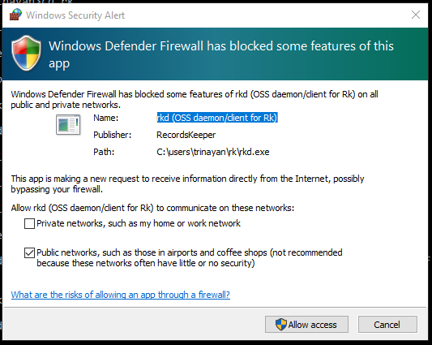
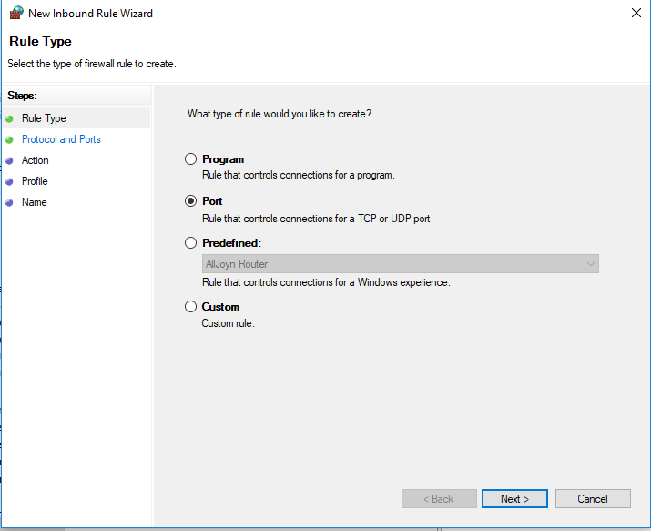
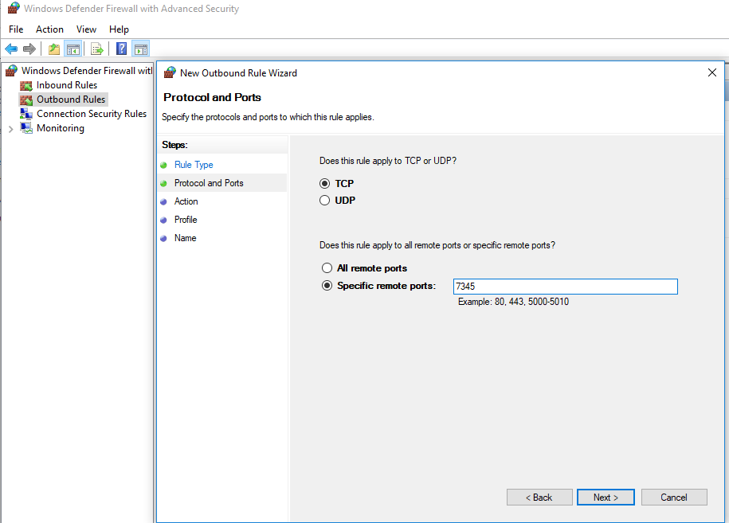
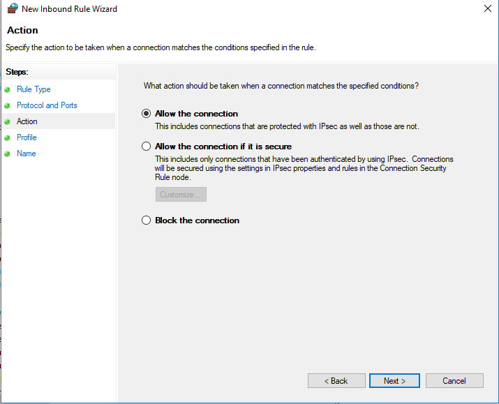
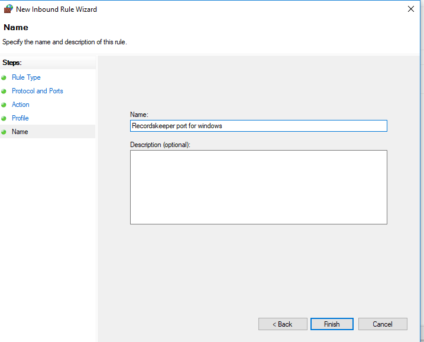
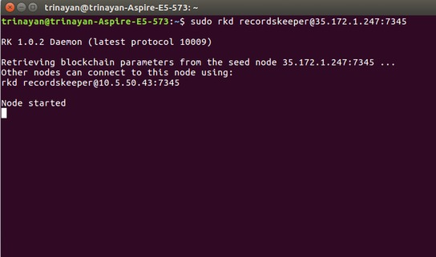
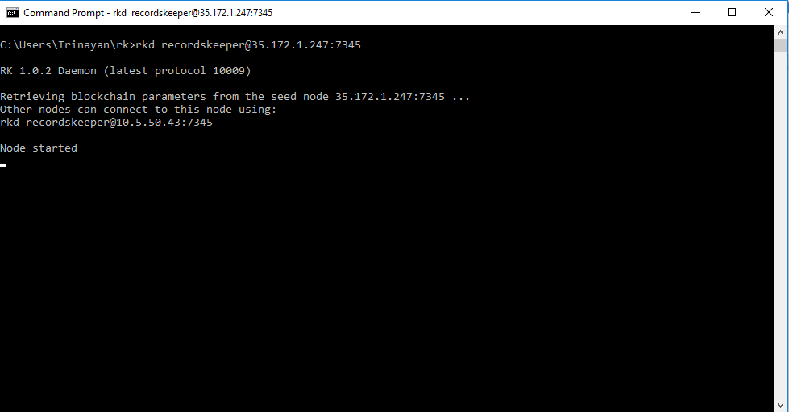
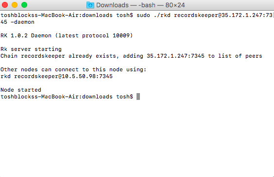

<<<<<<< HEAD
=========================================
Mining Guide for Recordskeeper Blockchain
=========================================

System requirements
-------------------

* Linux: 64-bit, supports Ubuntu 12.04+, CentOS 6.2+, Debian 7+, Fedora 15+, RHEL 6.2+.
* Windows: 64-bit, supports Windows 7, 8, 10, Server 2008 or later.
* Mac: 64-bit, supports OS X 10.12 (we hope to support earlier versions soon).
* 512 MB of RAM
* 1 GB of disk space

Installing Recordskeeper
------------------------ 

Linux (Ubuntu):
############### 

First Install these dependencies by executing below commands:

.. code-block:: bash

    sudo apt-get update
    sudo apt-get install build-essential libtool autotools-dev automake pkg-config libssl-dev libevent-dev bsdmainutils
    sudo apt-get install libboost-all-dev
    sudo add-apt-repository ppa:bitcoin/bitcoin
    sudo apt-get update
    sudo apt-get install libdb4.8-dev libdb4.8++-dev

To download the executable directly from the browser `click here <https://github.com/RecordsKeeper/recordskeeper-core/releases/download/v1.0.0/recordskeeper-1.0.0.tar.gz>`_ .

And, if you want to download it from the command line terminal then use this command:

.. code-block:: bash

    wget https://github.com/RecordsKeeper/recordskeeper-core/releases/download/v1.0.0/recordskeeper-1.0.0.tar.gz

Then, move to the location of the downloaded files and run following commands from your 
terminal:

.. code-block:: bash

    tar -xvzf recordskeeper-1.0.0.tar.gz
    cd recordskeeper-1.0.0
    mv rkd rk-cli rk-util /usr/local/bin 

Moving the RecordsKeeper files to bin directory make them easily accessible from the command line anywhere.

.. note::
    * if you get error then run the above commands using “sudo” for root privileges 
    * Use exit command (to return to your regular user)
    * Linux users move directly to the :ref:`connecting-rk` section

  
Windows :
#########

Download the executables from `here <https://github.com/RecordsKeeper/recordskeeper-core/releases/download/v1.0.0/recordskeeper-windows-1.0.0.zip>`_ and then unzip it and you will have the binary files: rkd.exe, rkd-cold.exe, rk-cli.exe and rk-util.exe.

Copy the folder to your desired location.

Then open your command line terminal and go to that location, after that run the following command:

.. code-block:: bash
    
    cd recordskeeper-windows-1.0.0

.. note::
    Windows users move directly to the :ref:`connecting-rk` section.

Mac OS:
#######

First Install these dependencies by executing below commands:

.. code-block:: bash

    Install XCode and XCode command line tools
    Install git from git-scm
    Install brew (follow instructions on brew.sh)
    brew install autoconf automake berkeley-db4 libtool boost@1.57 openssl pkg-config rename
    brew link boost@1.57 --force

To download the executable directly from the browser `click here <https://github.com/RecordsKeeper/recordskeeper-core/releases/download/v1.0.0/recordskeeper-mac-osx-1.0.0.zip>`_ .

Unzip the zip file and then move to the location of the downloaded files and run following commands from your 
terminal:

.. code-block:: bash

    cd recordskeeper-mac-osx-1.0.0
    mv rkd rk-cli rk-util /usr/local/bin 

Moving the RecordsKeeper files to bin directory make them easily accessible from the command line anywhere.

.. note::
    * if you get error then run the above commands using “sudo” for root privileges 
    * Use exit command (to return to your regular user)
    * Mac users move directly to the :ref:`connecting-rk` section

.. _connecting-rk:

Connecting to RecordsKeeper Blockchain
--------------------------------------

The RecordsKeeper Testnet Blockchain is avaialble for the users to Develop and Deploy applications over RecordsKeeper Blockchain, XRK Testnet tokens do not hold any value and are only avaialble for testing. You can earn XRK tokens from RecordsKeeper Mainnet mining.

Linux:
######

Now to connect to the RecordsKeeper Blockchain, run following command from the terminal:

**RecordsKeeper Testnet**

.. code-block:: bash

    rkd recordskeeper-test@35.170.155.89:8379

**RecordsKeeper Mainnet**

.. code-block:: bash

    rkd recordskeeper@35.172.1.247:7895

This command will initialize your node.

And, if you want your connection to remain active as a background process then run this command:

**RecordsKeeper Testnet**

.. code-block:: bash

    rkd recordskeeper-test@35.172.1.247:8379 -daemon

**RecordsKeeper Mainnet**

.. code-block:: bash

    rkd recordskeeper@35.172.1.247:7895 -daemon

.. note::
    Linux users now go to the :ref:`mining-permissions` section

Windows
#######

Now to connect to the RecordsKeeper Blockchain, first go into the directory where you have downloaded “recordskeeper-windows-1.0.0.zip” and then open command line terminal from that location:

**RecordsKeeper Testnet**

.. code-block:: bash

    rkd recordskeeper-test@35.170.155.89:8379 

**RecordsKeeper Mainnet**

.. code-block:: bash

    rkd recordskeeper@35.172.1.247:7895  

This command will initialize your node.

And, if you want your connection to remain active as a background process then run this command:

**RecordsKeeper Testnet**

.. code-block:: bash

    rkd recordskeeper-test@35.170.155.89:8379 -daemon

**RecordsKeeper Mainnet**

.. code-block:: bash

    rkd recordskeeper@35.172.1.247:7895 -daemon

If the Operating system does not pop up the allow firewall connections for rkd like shown below:

Then you have to manually allow connections through firewall by following the steps below:

Go to:

.. code-block:: bash

    Control Panel > System and Security > Windows Defender Firewall > Advanced Settings

And add Outbound rules by following these steps:

**Step 1:** First select the Rule type, as you have to create a rule for allowing the network port so select Port here and then press Next:

**Step 2:** Specify the port address of the RecordsKeeper Blockchain to which you are allowing access, for Testnet type 8379 and to open ports for Mainnet type 7345 in the textbox and then click on Next:

**Step 3:** Now click on *Allow the connection* and then press Next:

**Step 4:** Select all three profiles here for the rule to apply, and then click on Next:

.. image:: _static/Step4Outbound.png
   :align: center

**Step 5:** Now choose a name for the created Outbound rule and then press *Finish* to complete the process of opening up the ports.

.. note::
    If you want some other RecordsKeeper node to connect to your node then you have to allow connections by making Inbound rules for the same. Follow the same procedure after selecting a new Inbound rule.

.. note::
    Windows users now can go to the :ref:`mining-permissions` section.

Mac:
####

Now to connect to the RecordsKeeper Blockchain, run following command from the terminal:

**RecordsKeeper Testnet**

.. code-block:: bash

    ./rkd recordskeeper-test@35.170.155.89:8379

**RecordsKeeper Mainnet**

.. code-block:: bash

    ./rkd recordskeeper@35.172.1.247:7895

This command will initialize your node.

And, if you want your connection to remain active as a background process then run this command:

**RecordsKeeper Testnet**

.. code-block:: bash

    ./rkd recordskeeper-test@35.172.1.247:8379 -daemon

**RecordsKeeper Mainnet**

.. code-block:: bash

    ./rkd recordskeeper@35.172.1.247:7895 -daemon

In case of an error message like this: 

.. warning::

    Error: Couldn't initialize permission database for blockchain recordskeeper. Probably rkd for this blockchain is already running. Exiting...
    
First kill the daemon process and then try connecting to the RecordsKeeper Blockchain again. If the problem persists then restart your computer and then repeat the whole process of connecting to RecordsKeeper Blockchain again. 

.. note::

    *Mac users now go to the :ref:`mining-permissions` section

.. _mining-permissions:

Mining Permissions
------------------

RecordsKeeper on Linux
######################

You will see the folowing message on your Linux command line terminal after you execute the command to connect to the Recordskeeper blockchain.

RecordsKeeper on Windows
########################

You will see the following message on your Windows command line terminal after you execute the command to connect to the Recordskeeper blockchain.

RecordsKeeper on Mac
####################

You will see the folowing message on your Mac command line terminal after you execute the command to connect to the Recordskeeper blockchain.

.. image:: _static/MacRKD.jpg
   :align: center
   :width: 693.433px

RecordsKeeper Permissions
#########################

**RecordsKeeper Testnet**

The mining for RecordsKeeper Testnet is open for everyone so when you connect to RecordsKeeper Testnet, you will receive all the permissions for your default address

**RecordsKeeper Mainnet**

For Mainnet when your node gets connected, you will receive the permissions to connect, send and receive. Now look for your default XRK address from the command given below, which will display your node’s wallet address. This address is your “default XRK address” or “public address” of the Recordskeeper Blockchain in which you will receive XRK coins. To check the address, run the following command:

.. code-block:: bash

    rk-cli recordskeeper getaddresses
    ./rk-cli recordskeeper getaddresses                        #(for Mac Users)

Copy this address and send it to us `here <https://docs.google.com/forms/d/e/1FAIpQLSd1Dd2GAggCyom23HgiBhnQIjlLjMgRwf_UOQrHp9BUTRPEYA/viewform>`_ to recieve Mining Permissions for RecordsKeeper Mainnet.

After RecordsKeeper team grant mining permissions to your node address, only after that you would be able to mine XRK coins into your default address.

To retrieve private key for your node address run this command:

.. code-block:: bash

    rk-cli recordskeeper dumpprivkey {default_XRK_address}        #(input node_address without braces)
    ./rk-cli recordskeeper dumpprivkey {default_XRK_address}        #(for Mac Users)

.. note::
    Please store this private key safely, losing this will result in loss of XRK coins.

After completing the above process, you can check for your node’s information (best block and synced block) by running following commands:

.. code-block:: bash

    rk-cli recordskeeper getinfo                 #(for synced block)
    rk-cli recordskeeper getblockchaininfo       #(for best block)

    
    ./rk-cli recordskeeper getinfo                 #(for Mac Users)
    ./rk-cli recordskeeper getblockchaininfo       #(for Mac Users)

Your node will sync up to the best block, and then only your node can start mining and your balance will get updated with the mined XRK coins.

In case you have entered the wrong ip-address then it will report this error:

.. warning::

    Error: Couldn't initialize permission database for blockchain recordskeeper. Probably rkd for this blockchain is already running. Exiting...

Please check ip-address and port properly to connect to the RecordsKeeper Blockchain.

.. note::

    If you have already created a wallet address and you want to add it as your miner address then run this command from the command line terminal:
    
    .. code-block:: bash

        rk-cli recordskeeper importprivkey {private_key}      #(include private key without braces)
        ./rk-cli recordskeeper importprivkey {private_key}      #(for Mac Users)

Stopping Blockchain
-------------------

**RecordsKeeper Mainnet**

    In case you want to stop your running Recordskeeper node then you can use the following command from your command line terminal:

    .. code-block:: bash

        rk-cli recordskeeper stop
        ./rk-cli recordskeeper stop                          #(for Mac Users)

**RecordsKeeper Testnet**

    In case you want to stop your running Recordskeeper-test Blockchain node then you can use the following command from your command line terminal:

    .. code-block:: bash

        rk-cli recordskeeper-test stop
        ./rk-cli recordskeeper-test stop                    #(for Mac Users)
=======
=========================================
Mining Guide for Recordskeeper Blockchain
=========================================

System requirements
-------------------

* Linux: 64-bit, supports Ubuntu 12.04+, CentOS 6.2+, Debian 7+, Fedora 15+, RHEL 6.2+.
* Windows: 64-bit, supports Windows 7, 8, 10, Server 2008 or later.
* Mac: 64-bit, supports OS X 10.12 (we hope to support earlier versions soon).
* 512 MB of RAM
* 1 GB of disk space

Installing Recordskeeper
------------------------ 

Linux (Ubuntu):
############### 

First Install these dependencies by executing below commands:

.. code-block:: bash

    sudo apt-get update
    sudo apt-get install build-essential libtool autotools-dev automake pkg-config libssl-dev libevent-dev bsdmainutils
    sudo apt-get install libboost-all-dev
    sudo add-apt-repository ppa:bitcoin/bitcoin
    sudo apt-get update
    sudo apt-get install libdb4.8-dev libdb4.8++-dev

To download the executable directly from the browser `click here <https://github.com/RecordsKeeper/recordskeeper-core/releases/download/v1.0.0/recordskeeper-1.0.0.tar.gz>`_ .

And, if you want to download it from the command line terminal then use this command:

.. code-block:: bash

    wget https://github.com/RecordsKeeper/recordskeeper-core/releases/download/v1.0.0/recordskeeper-1.0.0.tar.gz

Then, move to the location of the downloaded files and run following commands from your 
terminal:

.. code-block:: bash

    tar -xvzf recordskeeper-1.0.0.tar.gz
    cd recordskeeper-1.0.0
    mv rkd rk-cli rk-util /usr/local/bin 

Moving the RecordsKeeper files to bin directory make them easily accessible from the command line anywhere.

.. note::
    * if you get error then run the above commands using “sudo” for root privileges 
    * Use exit command (to return to your regular user)
    * Linux users move directly to the :ref:`connecting-rk` section

  
Windows :
#########

Download the executables from `here <https://github.com/RecordsKeeper/recordskeeper-core/releases/download/v1.0.0/recordskeeper-windows-1.0.0.zip>`_ and then unzip it and you will have the binary files: rkd.exe, rkd-cold.exe, rk-cli.exe and rk-util.exe.

Copy the folder to your desired location.

Then open your command line terminal and go to that location, after that run the following command:

.. code-block:: bash
    
    cd recordskeeper-windows-1.0.0

.. note::
    Windows users move directly to the :ref:`connecting-rk` section.

Mac OS:
#######

First Install these dependencies by executing below commands:

.. code-block:: bash

    Install XCode and XCode command line tools
    Install git from git-scm
    Install brew (follow instructions on brew.sh)
    brew install autoconf automake berkeley-db4 libtool boost@1.57 openssl pkg-config rename
    brew link boost@1.57 --force

To download the executable directly from the browser `click here <https://github.com/RecordsKeeper/recordskeeper-core/releases/download/v1.0.0/recordskeeper-mac-osx-1.0.0.zip>`_ .

Unzip the zip file and then move to the location of the downloaded files and run following commands from your 
terminal:

.. code-block:: bash

    cd recordskeeper-mac-osx-1.0.0
    mv rkd rk-cli rk-util /usr/local/bin 

Moving the RecordsKeeper files to bin directory make them easily accessible from the command line anywhere.

.. note::
    * if you get error then run the above commands using “sudo” for root privileges 
    * Use exit command (to return to your regular user)
    * Mac users move directly to the :ref:`connecting-rk` section

.. _connecting-rk:

Connecting to RecordsKeeper Blockchain
--------------------------------------

The RecordsKeeper Testnet Blockchain is avaialble for the users to Develop and Deploy applications over RecordsKeeper Blockchain, XRK Testnet tokens do not hold any value and are only avaialble for testing. You can earn XRK tokens from RecordsKeeper Mainnet mining.

Linux
#####

Now to connect to the RecordsKeeper Blockchain, run following command from the terminal:

**RecordsKeeper Testnet**

.. code-block:: bash

    rkd recordskeeper-test@35.170.155.89:8379

**RecordsKeeper Mainnet**

.. code-block:: bash

    rkd recordskeeper@35.172.1.247:7345

This command will initialize your node.

And, if you want your connection to remain active as a background process then run this command:

**RecordsKeeper Testnet**

.. code-block:: bash

    rkd recordskeeper-test@35.172.1.247:8379 -daemon

**RecordsKeeper Mainnet**

.. code-block:: bash

    rkd recordskeeper@35.172.1.247:7345 -daemon

.. note::
    Linux users now go to the :ref:`mining-permissions` section

Windows
#######

Now to connect to the RecordsKeeper Blockchain, first go into the directory where you have downloaded “recordskeeper-windows-1.0.0.zip” and then open command line terminal from that location:

**RecordsKeeper Testnet**

.. code-block:: bash

    rkd recordskeeper-test@35.170.155.89:8379 

**RecordsKeeper Mainnet**

.. code-block:: bash

    rkd recordskeeper@35.172.1.247:7345  

This command will initialize your node.

And, if you want your connection to remain active as a background process then run this command:

**RecordsKeeper Testnet**

.. code-block:: bash

    rkd recordskeeper-test@35.170.155.89:8379 -daemon

**RecordsKeeper Mainnet**

.. code-block:: bash

    rkd recordskeeper@35.172.1.247:7345 -daemon

If the Operating system does not pop up the allow firewall connections for rkd like shown below:

Then you have to manually allow connections through firewall by following the steps below:

Go to:

.. code-block:: bash

    Control Panel > System and Security > Windows Defender Firewall > Advanced Settings

And add Outbound rules by following these steps:

**Step 1:** First select the Rule type, as you have to create a rule for allowing the network port so select Port here and then press Next:

**Step 2:** Specify the port address of the RecordsKeeper Blockchain to which you are allowing access, for Testnet type 8379 and to open ports for Mainnet type 7345 in the textbox and then click on Next:

**Step 3:** Now click on *Allow the connection* and then press Next:

**Step 4:** Select all three profiles here for the rule to apply, and then click on Next:

.. image:: _static/Step4Outbound.png
   :align: center

**Step 5:** Now choose a name for the created Outbound rule and then press *Finish* to complete the process of opening up the ports.

.. note::
    If you want some other RecordsKeeper node to connect to your node then you have to allow connections by making Inbound rules for the same. Follow the same procedure after selecting a new Inbound rule.

.. note::
    Windows users now can go to the :ref:`mining-permissions` section.

Mac
###

Now to connect to the RecordsKeeper Blockchain, run following command from the terminal:

**RecordsKeeper Testnet**

.. code-block:: bash

    ./rkd recordskeeper-test@35.170.155.89:8379

**RecordsKeeper Mainnet**

.. code-block:: bash

    ./rkd recordskeeper@35.172.1.247:7345

This command will initialize your node.

And, if you want your connection to remain active as a background process then run this command:

**RecordsKeeper Testnet**

.. code-block:: bash

    ./rkd recordskeeper-test@35.172.1.247:8379 -daemon

**RecordsKeeper Mainnet**

.. code-block:: bash

    ./rkd recordskeeper@35.172.1.247:7345 -daemon

In case of an error message like this: 

.. warning::

    Error: Couldn't initialize permission database for blockchain recordskeeper. Probably rkd for this blockchain is already running. Exiting...
    
First kill the daemon process and then try connecting to the RecordsKeeper Blockchain again. If the problem persists then restart your computer and then repeat the whole process of connecting to RecordsKeeper Blockchain again. 

.. note::

    Mac users can now move to the :ref:`mining-permissions` section

.. _mining-permissions:

Mining Permissions
------------------

RecordsKeeper on Linux
######################

You will see the folowing message on your Linux command line terminal after you execute the command to connect to the Recordskeeper blockchain.

RecordsKeeper on Windows
########################

You will see the following message on your Windows command line terminal after you execute the command to connect to the Recordskeeper blockchain.

RecordsKeeper on Mac
####################

You will see the folowing message on your Mac command line terminal after you execute the command to connect to the Recordskeeper Blockchain.

RecordsKeeper Permissions
#########################

**RecordsKeeper Testnet**

The mining for RecordsKeeper Testnet is open for everyone so when you connect to RecordsKeeper Testnet, you will receive all the permissions for your default address

**RecordsKeeper Mainnet**

For Mainnet when your node gets connected, you will receive the permissions to connect, send and receive. Now look for your default XRK address from the command given below, which will display your node’s wallet address. This address is your “default XRK address” or “public address” of the Recordskeeper Blockchain in which you will receive XRK coins. To check the address, run the following command:

.. code-block:: bash

    rk-cli recordskeeper getaddresses
    ./rk-cli recordskeeper getaddresses                        #(for Mac Users)

Copy this address and send it to us `here <https://docs.google.com/forms/d/e/1FAIpQLSd1Dd2GAggCyom23HgiBhnQIjlLjMgRwf_UOQrHp9BUTRPEYA/viewform>`_ to recieve Mining Permissions for RecordsKeeper Mainnet.

After RecordsKeeper team grant mining permissions to your node address, only after that you would be able to mine XRK coins into your default address.

To retrieve private key for your node address run this command:

.. code-block:: bash

    rk-cli recordskeeper dumpprivkey {default_XRK_address}        #(input node_address without braces)
    ./rk-cli recordskeeper dumpprivkey {default_XRK_address}        #(for Mac Users)

.. note::
    Please store this private key safely, losing this will result in loss of XRK coins.

After completing the above process, you can check for your node’s information (best block and synced block) by running following commands:

.. code-block:: bash

    rk-cli recordskeeper getinfo                 #(for synced block)
    rk-cli recordskeeper getblockchaininfo       #(for best block)

    
    ./rk-cli recordskeeper getinfo                 #(for Mac Users)
    ./rk-cli recordskeeper getblockchaininfo       #(for Mac Users)

Your node will sync up to the best block, and then only your node can start mining and your balance will get updated with the mined XRK coins.

In case you have entered the wrong ip-address then it will report this error:

.. warning::

    Error: Couldn't initialize permission database for blockchain recordskeeper. Probably rkd for this blockchain is already running. Exiting...

Please check ip-address and port properly to connect to the RecordsKeeper Blockchain.

.. note::

    If you have already created a wallet address and you want to add it as your miner address then run this command from the command line terminal:
    
    .. code-block:: bash

        rk-cli recordskeeper importprivkey {private_key}      #(include private key without braces)
        ./rk-cli recordskeeper importprivkey {private_key}      #(for Mac Users)

Stopping Blockchain
-------------------

**RecordsKeeper Mainnet**

    In case you want to stop your running Recordskeeper node then you can use the following command from your command line terminal:

    .. code-block:: bash

        rk-cli recordskeeper stop
        ./rk-cli recordskeeper stop                          #(for Mac Users)

**RecordsKeeper Testnet**

    In case you want to stop your running Recordskeeper-test Blockchain node then you can use the following command from your command line terminal:

    .. code-block:: bash

        rk-cli recordskeeper-test stop
        ./rk-cli recordskeeper-test stop                    #(for Mac Users)
>>>>>>> 923220d2d0167096ca60158285f3ac5ba073a2fd
