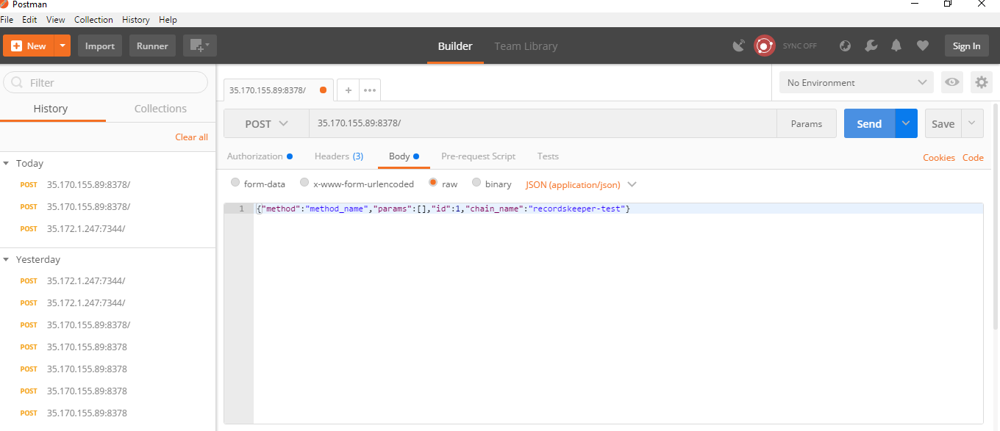
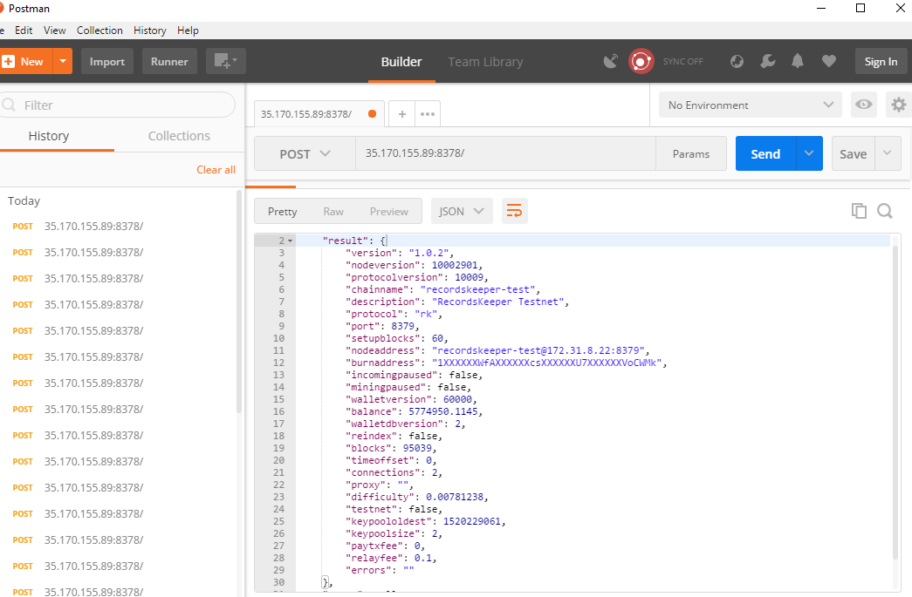
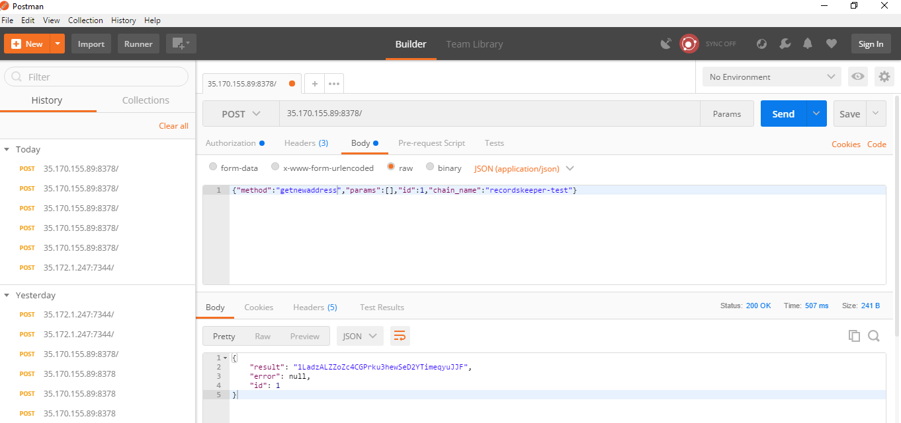
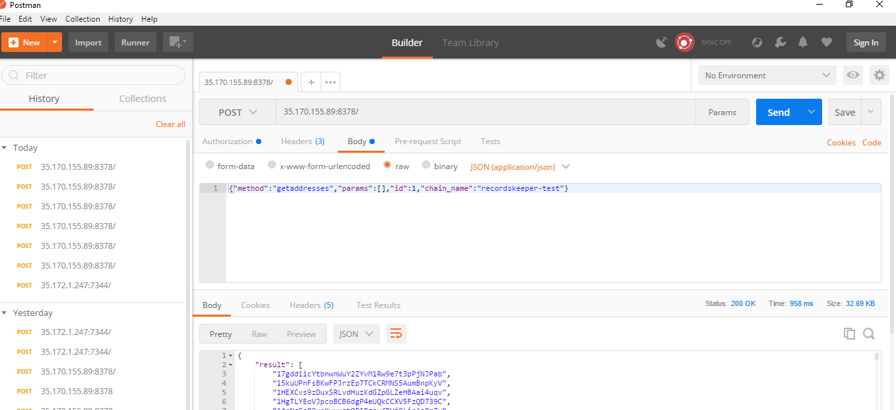
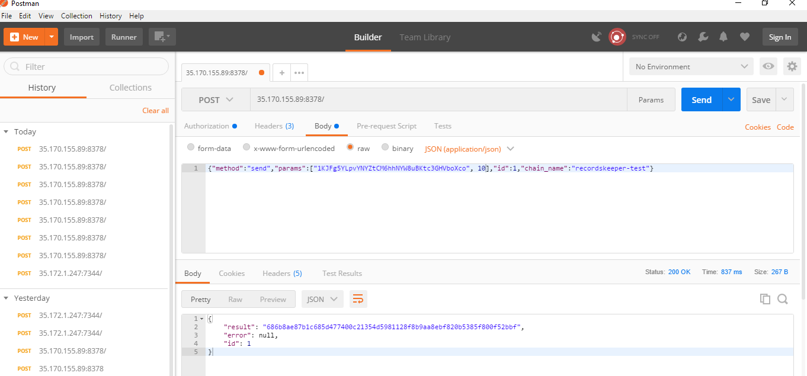
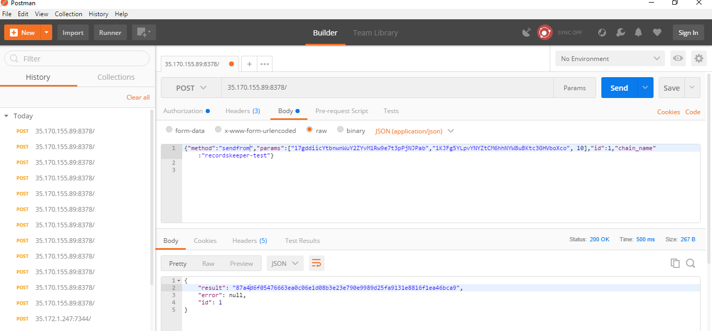
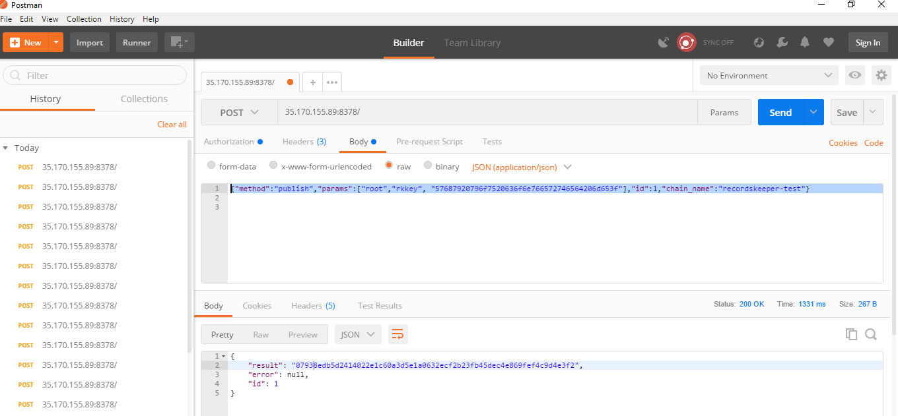
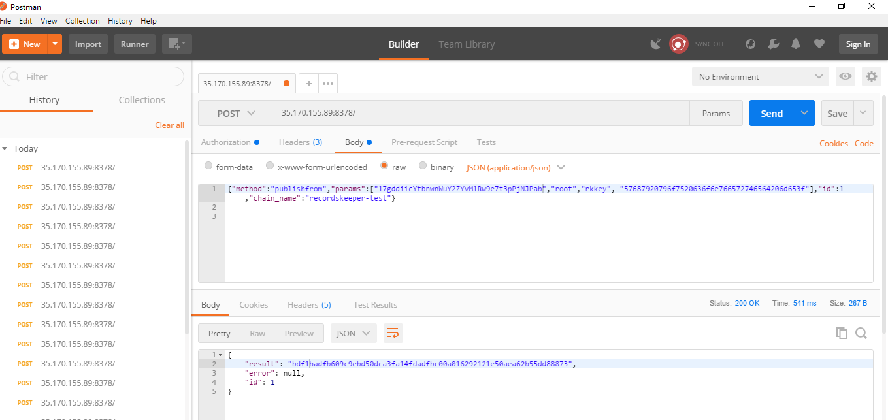
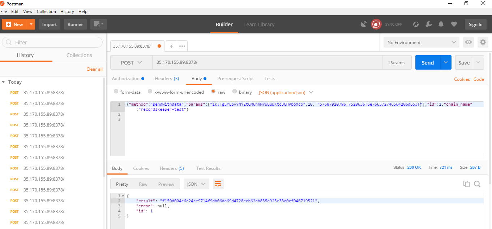

=======================
Getting Started with Postman
=======================

This tutorial requires you to setup a RecordsKeeper Blockchain and run the APIs through Postman client. If you have not done so already, please download and install RecordsKeeper on a server. If you are using Recordskeeper Blockchain on Windows, please read the Installation of Windows notes to adapt the instructions below.

Download the latest `RecordsKeeper <https://github.com/RecordsKeeper/recordskeeper-core/releases>`_ build and put the downloded files under the root folder. You can also run these commands from the folder where the files are present.

Download the `Postman client <https://www.getpostman.com/apps>`_ from here.

Setting Postman client
----------------------

Set the following parameters to request JSON RPC commands for RecordsKeeper.

Request-type
############

Select POST method in Postman client for using RecordsKeeper JSON RPC APIs.

Endpoint
########

Enter the following endpoint in the url:

.. code-block:: bash

		35.170.155.89:8378/

Authorization
#############

To setup Authorization parameters first select the type of Authentication to: **Basic Auth**. You have to enter the Username and Password for your node for authorization which you can access through rk.conf built in your recordskeeper directory.

**Linux (Ubuntu):**

From your terminal run following commands:

.. code-block:: bash

		cd ~/.rk/recordskeeper/
		cat rk.conf

It will open the configuration file from where you can copy rpcuser and rpcpassword of your node. Enter these in username and password textbox of the postman client.

**Windows:**

Go to the directory:

.. code-block:: bash

		AppData > Roaming > Rk > recordskeeper

Then look for the rk.conf file and open it in any text text editor. It will display rpcuser and rpcpassword of your node. Enter these in username and password textbox of the postman client.

Headers
#######

Headers are used to specify the metadata for the request type. It is a key-value based entry. Enter the following key-value entries in your header:

.. code-block:: bash

		Content-type : application/json
		Cache-control : no-cache

Body
####

Select the **Raw** type in your request. The Post API request will be in following format which is to be added inside the body of the request:

.. code-block:: bash

		{"method":"method_name","params":[],"id":1,"chain_name":"recordskeeper-test"}

Running API commnads through Postman
------------------------------------

Now your Postman client is set up and running, so you can use JSON RPC API commands to extract information, send transaction and publish data over the Recordskeeper node. Some of the important requests are as follows which are to requested under the body of the Postman client:

* Get general information about the RecordsKeeper Node:

.. code-block:: bash

	{"method":"getinfo","params":[],"id":1,"chain_name":"recordskeeper-test"}

The following result will be displayed:

* Create a new address in the RecordsKeeper Node wallet:

.. code-block:: bash

	{"method":"getnewaddress","params":[],"id":1,"chain_name":"recordskeeper-test"}

The following result will be displayed:

* List you all addresses in the RecordsKeeper Node wallet:

.. code-block:: bash

	{"method":"getaddresses","params":[],"id":1,"chain_name":"recordskeeper-test"}

The following result will be displayed:

Sending a Transaction in RecordsKeeper
--------------------------------------

The RecordsKeeper Blockchain works on the same backend as Bitcoin algorithms. Both the RecordsKeeper Testnet and Mainnet can be used to send and recieve XRK tokens. Use the following API commands to send transactions in RecordsKeeper Blockchain.

Send
####

.. code-block:: bash
  
	{"method":"send","params":["1KJFg5YLpvYNYZtCM6hhNYW8uBKtc3GHVboXco", 10],"id":1,"chain_name":"recordskeeper-test"}

The following result will be displayed:

This command is used to Send one or more XRK tokens to address, returning the txid. The amount field is the quantity of the XRK token and the address field is the address where you want to send the XRK tokens. This command will use the Node's root address to send the transaction. Please make sure you have sufficient balance in the Node's root address for transaction to propogate over the RecordsKeeper Blockchain. You can also provide specific comments for the transaction which are optional. The fees will be applied as per the transaction size.

Send from a different address
#############################

.. code-block:: bash

	{"method":"sendfrom","params":["17gddiicYtbnwnWuY2ZYvM1Rw9e7t3pPjNJPab","1KJFg5YLpvYNYZtCM6hhNYW8uBKtc3GHVboXco", 10],"id":1,"chain_name":"recordskeeper-test"}

The following result will be displayed:

This command is also used to Send one or more XRK tokens to address, returning the txid. Using this command you can specify the from address which you want to use to send the transaction. The amount field is the quantity of the XRK token and the to-address field is the address where you want to send the XRK tokens. Please make sure you have sufficient balance in the from-address for transaction to propogate over the RecordsKeeper Blockchain. The from-address used here is also one of the address generated for the Node. You can also provide specific comments for the transaction which are optional. The fees will be applied as per the transaction size.

Publishing and Retriving data in RecordsKeeper
----------------------------------------------

The RecordsKeeper Blockchain is a open public Key-Value based Database over the Blockchain. You can use the interactive command line to publish and retirive stored information. As the Blockahin is a shared concept you can view all the published data and retrive it only using a key or address. RecordsKeeper uses the streams to store the data. RecordsKeeper Streams provide a natural abstraction for RecordsKeeper blockchain which focus on general data retrieval, timestamping and archiving, rather than the transfer of tokens between participants.

The "root" stream is open to all and anyone can publish data into the root stream. Following commands will give you a brief about how to work with data over RecordsKeeper Blockchain.

Publish
#######

.. code-block:: bash

	{"method":"publish","params":["root","rkkey", "57687920796f7520636f6e766572746564206d653f"],"id":1,"chain_name":"recordskeeper-test"}

The following result will be displayed:

This command publishes an item in stream, the stream name is passed, with key provided in text form and data-hex in hexadecimal format. It returns ref or creation txid. The data is published using the Node's address. Use the next command discussed below to publish data from different address. The mining fees is applied as per the transaction size.

Publish from a different address
################################

.. code-block:: bash

	{"method":"publishfrom","params":["17gddiicYtbnwnWuY2ZYvM1Rw9e7t3pPjNJPab","root","rkkey", "57687920796f7520636f6e766572746564206d653f"],"id":1,"chain_name":"recordskeeper-test"}

The following result will be displayed:

This command works like publish, but publishes the item from from-address. It is useful if the node has multiple addresses with different amounts. The mining fees is applied as per the transaction size.

Send as Transaction
###################

.. code-block:: bash

    {"method":"sendwithdata","params":["1KJFg5YLpvYNYZtCM6hhNYW8uBKtc3GHVboXco",10, "57687920796f7520636f6e766572746564206d653f"],"id":1,"chain_name":"recordskeeper-test"}

The following result will be displayed:

This works similar to send, but with an additional data-only transaction output. You can pass raw data as data-hex hexadecimal string. It is also used to publish the data to a stream, pass an object like this {"for":StreamName,"key":"KeyName","data":"DataHex"} where stream is a stream name, ref or creation txid, the key is in text form, and the data is hexadecimal. You can pass the amount as 0, if you are only using this to publish the data over the RecordsKeeper stream. You can also send some XRK tokens while publishing the data over the stream. The fees will be applied as per the transaction size.

.. note::
   The address displayed here is a demo address. Please don't use this address in your transactions. You can create a new wallet or address by using the `RecordsKeeper Wallet <https://wallet.recordskeeper.co/>`_